---
## Front matter
title: "Отчёт по лабораторной работе №2"
subtitle: "Дисциплина: Архитектура компьютера"
author: "Кижваткина Анна Юрьевна"

## Generic otions
lang: ru-RU
toc-title: "Содержание"

## Bibliography
bibliography: bib/cite.bib
csl: pandoc/csl/gost-r-7-0-5-2008-numeric.csl

## Pdf output format
toc: true # Table of contents
toc-depth: 2
lof: true # List of figures
lot: true # List of tables
fontsize: 12pt
linestretch: 1.5
papersize: a4
documentclass: scrreprt
## I18n polyglossia
polyglossia-lang:
  name: russian
  options:
	- spelling=modern
	- babelshorthands=true
polyglossia-otherlangs:
  name: english
## I18n babel
babel-lang: russian
babel-otherlangs: english
## Fonts
mainfont: IBM Plex Serif
romanfont: IBM Plex Serif
sansfont: IBM Plex Sans
monofont: IBM Plex Mono
mathfont: STIX Two Math
mainfontoptions: Ligatures=Common,Ligatures=TeX,Scale=0.94
romanfontoptions: Ligatures=Common,Ligatures=TeX,Scale=0.94
sansfontoptions: Ligatures=Common,Ligatures=TeX,Scale=MatchLowercase,Scale=0.94
monofontoptions: Scale=MatchLowercase,Scale=0.94,FakeStretch=0.9
mathfontoptions:
## Biblatex
biblatex: true
biblio-style: "gost-numeric"
biblatexoptions:
  - parentracker=true
  - backend=biber
  - hyperref=auto
  - language=auto
  - autolang=other*
  - citestyle=gost-numeric
## Pandoc-crossref LaTeX customization
figureTitle: "Рис."
tableTitle: "Таблица"
listingTitle: "Листинг"
lofTitle: "Список иллюстраций"
lotTitle: "Список таблиц"
lolTitle: "Листинги"
## Misc options
indent: true
header-includes:
  - \usepackage{indentfirst}
  - \usepackage{float} # keep figures where there are in the text
  - \floatplacement{figure}{H} # keep figures where there are in the text
---

# Цель работы

Целью данной лабораторной работы является получение практических навыков работы с системой Git при помощи командной строки. В ходе неё мы я изучить идеологию и применение средств контроля версий.

# Задание

    1. Настройка github.
    2. Базовая настройка git.
    3. Создание SSH ключа.
    4. Создание рабочего пространства и репозитория курса на основе шаблона.
    5. Создание репозитория курса на основе шаблона.
    6. Настройка каталога курса.
    7. Выполнение заданий для самостоятельной работы.

# Теоретическое введение

Здесь описываются теоретические аспекты, связанные с выполнением работы.

Например, в табл. [-@tbl:std-dir] приведено краткое описание стандартных каталогов Unix.

: Описание некоторых каталогов файловой системы GNU Linux {#tbl:std-dir}

| Имя каталога | Описание каталога                                                                                                          |
|--------------|----------------------------------------------------------------------------------------------------------------------------|
| `/`          | Корневая директория, содержащая всю файловую                                                                               |
| `/bin `      | Основные системные утилиты, необходимые как в однопользовательском режиме, так и при обычной работе всем пользователям     |
| `/etc`       | Общесистемные конфигурационные файлы и файлы конфигурации установленных программ                                           |
| `/home`      | Содержит домашние директории пользователей, которые, в свою очередь, содержат персональные настройки и данные пользователя |
| `/media`     | Точки монтирования для сменных носителей                                                                                   |
| `/root`      | Домашняя директория пользователя  `root`                                                                                   |
| `/tmp`       | Временные файлы                                                                                                            |
| `/usr`       | Вторичная иерархия для данных пользователя                                                                                 |

Более подробно про Unix см. в [@tanenbaum_book_modern-os_ru; @robbins_book_bash_en; @zarrelli_book_mastering-bash_en; @newham_book_learning-bash_en].

# Выполнение лабораторной работы

3.1 Настройка Github
Создаю учетную запись на сайте Github. Заполняю основные данные для учетной записи.

3.2 Базовая настройка git.
Открываю терминал, делаю предварительную конфигурацию git. Вводим команду git config --global user.name "" и указываем имя, следом вводим git config --global user.email "", вписывая электронную почту аккаунта github. (рис. [-@fig:001] и рис. [-@fig:002])

{#fig:001 width=70%}

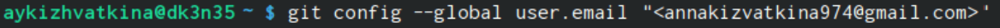{#fig:002 width=70%}

Настраиваем utf-8 в выводе сообщений git. (рис. [-@fig:003])

{#fig:003 width=70%}

Задаем имя для начальной ветки. Она будет называться «master». (рис. [-@fig:004])

{#fig:004 width=70%}

Задаем параметры autocrlf и safecrlf для корректного выполнения команд. (рис. [-@fig:005] и рис. [-@fig:006])

{#fig:005 width=70%}

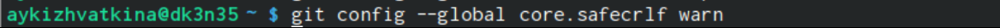{#fig:006 width=70%}

3.3 Создание SSH ключа.

Для последующей идентификации пользователя на сервере репозиториев необходимо сгенерировать пару ключей (приватный и открытый). Для этого вводим в командную строку команду ssh-keygen –C “”, вводя имя пользователя и электронную почту. Ключ автоматически сохранится в ~/.ssh/. (рис. [-@fig:007])

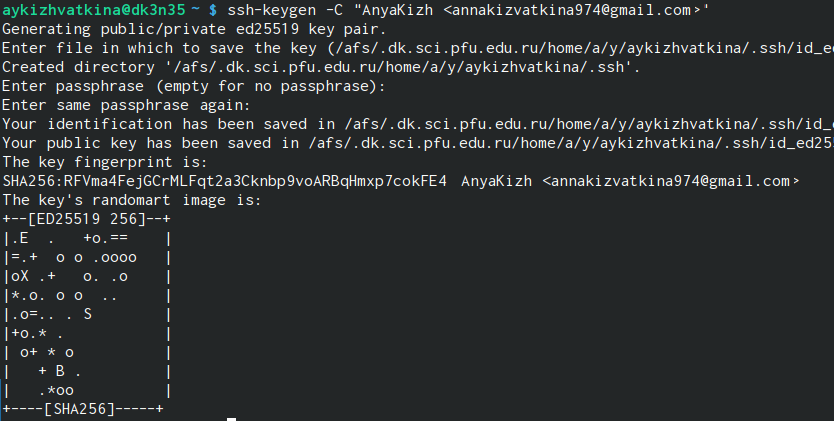{#fig:007 width=70%}

Далее загружаем сгенеренный открытый ключ. Заходим на сайт под своей учетной записью, переходим в меню, находим меню ключей и создаем новый ключ. (рис. [-@fig:008])

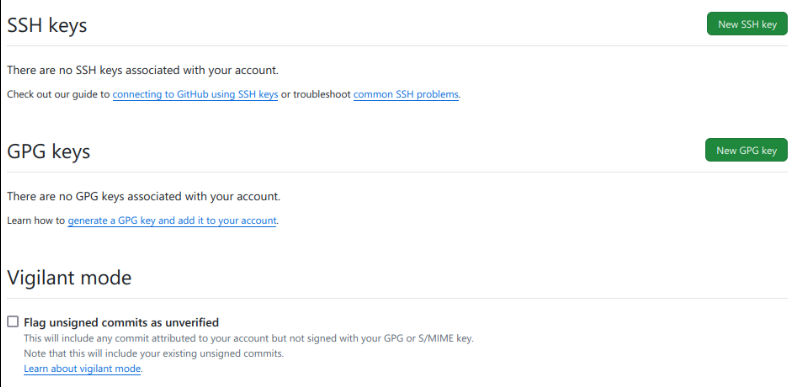{#fig:008 width=70%}

Копируем из локальной консоли ключ в буфер обмена. (рис. [-@fig:009])

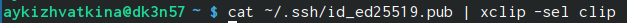{#fig:009 width=70%}

Вставляем ключ в поле сайта и указываем имя для ключа. (рис. [-@fig:010])

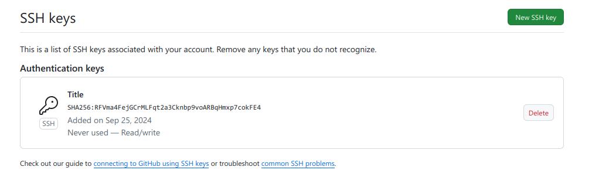{#fig:010 width=70%}

3.4 Создание рабочего пространства и репозитория курса на основе шаблона.

Открываем терминал и создаем каталог для предмета “Архитектура компьютера”. (рис. [-@fig:011])

{#fig:011 width=70%}

3.5 Создание репозитория курса на основе шаблона.

Переходим на станицу github в репозиторий с шаблоном курса https://github.com/yamadharma/cour se-directory-student-template. Далее выбираем “Use this template”. (рис. [-@fig:012])

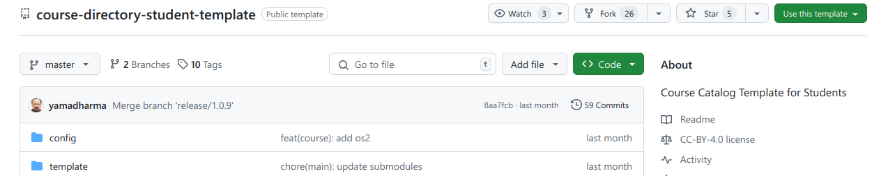{#fig:012 width=70%}

В открывшемся окне задаем имя репозитория. Создаем репозиторий. Проверяем создался ли репозиторий. (рис. [-@fig:013] и рис. [-@fig:014])

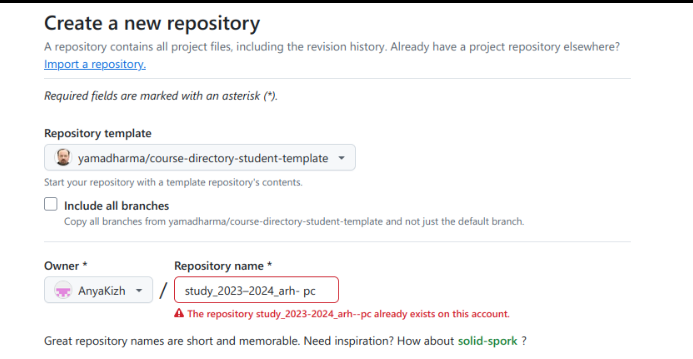{#fig:013 width=70%}

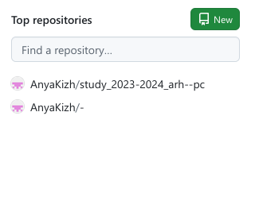{#fig:014 width=70%}

Открываем терминал и переходим в каталог курса при помощи cd. (рис. [-@fig:015])
 
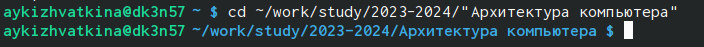{#fig:015 width=70%}

Клонируем созданный репозиторий и помощи команды git clone –recursive ‘’. (рис. [-@fig:016])

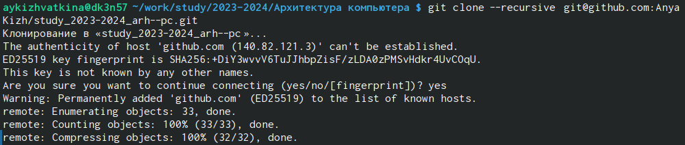{#fig:016 width=70%}

Копируем ссылку для клонирования на странице созданного репозитория. Переходим в окно Code, следом в SSH. (рис. [-@fig:017])

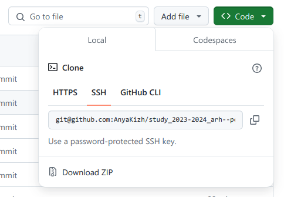{#fig:017 width=70%}

3.6 Настройка каталога курса.

Переходим в каталог курса при помощи cd. (рис. [-@fig:018])

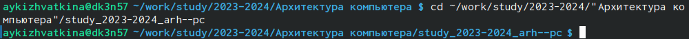{#fig:018 width=70%}

Удаляем лишние файлы. (рис. [-@fig:019])

{#fig:019 width=70%}

Создаем необходимые каталоги. (рис. [-@fig:020])

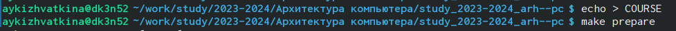{#fig:020 width=70%}

Отправляем файлы на сервер используя команды git add ., git commit –am и git push. (рис. [-@fig:021] и рис. [-@fig:022])

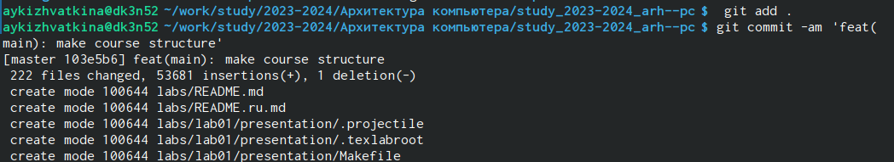{#fig:021 width=70%}

{#fig:022 width=70%}

Проверяем правильность создания иерархии рабочего пространства в локальном репозитории и на странице github. (рис. [-@fig:023])

{#fig:023 width=70%}

3.7 Выполнение заданий для самостоятельной работы.

Переходим в labs/lab02/report с помощью cd. (рис. [-@fig:024])

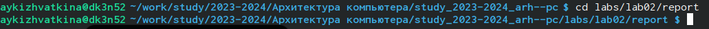{#fig:024 width=70%}

Создаем файл для отчета по лабораторной работе, используя touch. (рис. [-@fig:025])

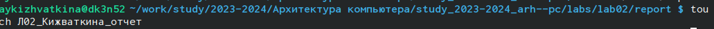{#fig:025 width=70%}

Переходим из подкаталога lab02/report в подкаталог lab01/report. (рис. [-@fig:026])

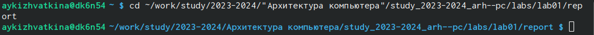{#fig:026 width=70%}

Копируем первую лабораторную с помощью cp и проверяем правильность выполнения команды. (рис. [-@fig:027])

{#fig:027 width=70%}

Переходим в подкаталог lab02/report. Копируем вторую лабораторную в каталог и проверяем правильность выполнения. (рис. [-@fig:028] и рис. [-@fig:029])

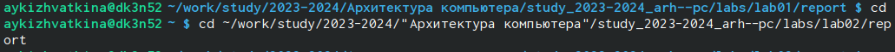{#fig:028 width=70%}

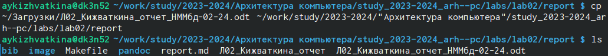{#fig:029 width=70%}

При помощи команды git add ‘’ добавляем новые файлы. (рис. [-@fig:030])

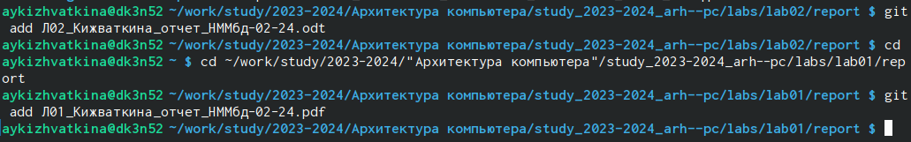{#fig:030 width=70%}

Сохраняем изменение при помощи команды git commit –am. Переносим в репозиторий сохраненные изменения командой git pish. (рис. [-@fig:031])

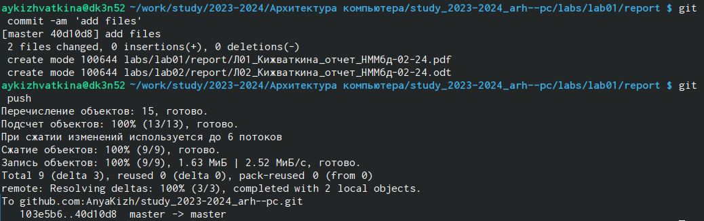{#fig:031 width=70%}

Проверяем на сайте правильность выполнения заданий. (рис. [-@fig:032] и рис. [-@fig:033])

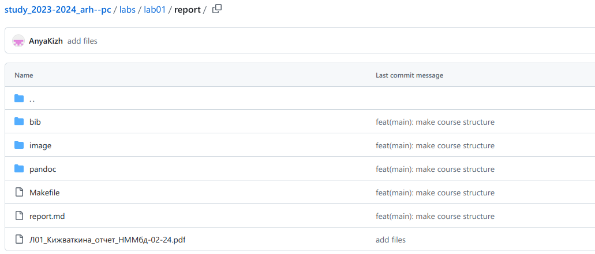{#fig:032 width=70%}

{#fig:033 width=70%}

# Выводы

При выполнении данной лабораторной работы мы изучили идеологию и применение средств контроля версий, а также приобрели практические навыки по работе с системой git.

# Список литературы{.unnumbered}

::: {#refs}
:::
