---
## Front matter
title: "Отчёт по лабораторной работе №4"
subtitle: "Дисциплина: Архитектура компьютера"
author: "Кижваткина Анна Юрьевна"

## Generic otions
lang: ru-RU
toc-title: "Содержание"

## Bibliography
bibliography: bib/cite.bib
csl: pandoc/csl/gost-r-7-0-5-2008-numeric.csl

## Pdf output format
toc: true # Table of contents
toc-depth: 2
lof: true # List of figures
lot: true # List of tables
fontsize: 12pt
linestretch: 1.5
papersize: a4
documentclass: scrreprt
## I18n polyglossia
polyglossia-lang:
  name: russian
  options:
	- spelling=modern
	- babelshorthands=true
polyglossia-otherlangs:
  name: english
## I18n babel
babel-lang: russian
babel-otherlangs: english
## Fonts
mainfont: IBM Plex Serif
romanfont: IBM Plex Serif
sansfont: IBM Plex Sans
monofont: IBM Plex Mono
mathfont: STIX Two Math
mainfontoptions: Ligatures=Common,Ligatures=TeX,Scale=0.94
romanfontoptions: Ligatures=Common,Ligatures=TeX,Scale=0.94
sansfontoptions: Ligatures=Common,Ligatures=TeX,Scale=MatchLowercase,Scale=0.94
monofontoptions: Scale=MatchLowercase,Scale=0.94,FakeStretch=0.9
mathfontoptions:
## Biblatex
biblatex: true
biblio-style: "gost-numeric"
biblatexoptions:
  - parentracker=true
  - backend=biber
  - hyperref=auto
  - language=auto
  - autolang=other*
  - citestyle=gost-numeric
## Pandoc-crossref LaTeX customization
figureTitle: "Рис."
tableTitle: "Таблица"
listingTitle: "Листинг"
lofTitle: "Список иллюстраций"
lotTitle: "Список таблиц"
lolTitle: "Листинги"
## Misc options
indent: true
header-includes:
  - \usepackage{indentfirst}
  - \usepackage{float} # keep figures where there are in the text
  - \floatplacement{figure}{H} # keep figures where there are in the text
---

# Цель работы

Целью данной работы является освоение процедуры компиляции и сборки программ, написанных на ассемблере NASM.

# Задание

1. Создание программы Hello world!
2. Транслятор NASM.
3. Работа с расширенным синтаксисом командной строки NASM.
4. Работа с компоновщиком LD.
5. Запуск исполняемого файла.
6. Выполнение задания для самостоятельной работы.

# Теоретическое введение

Здесь описываются теоретические аспекты, связанные с выполнением работы.

Например, в табл. [-@tbl:std-dir] приведено краткое описание стандартных каталогов Unix.

: Описание некоторых каталогов файловой системы GNU Linux {#tbl:std-dir}

| Имя каталога | Описание каталога                                                                                                          |
|--------------|----------------------------------------------------------------------------------------------------------------------------|
| `/`          | Корневая директория, содержащая всю файловую                                                                               |
| `/bin `      | Основные системные утилиты, необходимые как в однопользовательском режиме, так и при обычной работе всем пользователям     |
| `/etc`       | Общесистемные конфигурационные файлы и файлы конфигурации установленных программ                                           |
| `/home`      | Содержит домашние директории пользователей, которые, в свою очередь, содержат персональные настройки и данные пользователя |
| `/media`     | Точки монтирования для сменных носителей                                                                                   |
| `/root`      | Домашняя директория пользователя  `root`                                                                                   |
| `/tmp`       | Временные файлы                                                                                                            |
| `/usr`       | Вторичная иерархия для данных пользователя                                                                                 |

Более подробно про Unix см. в [@tanenbaum_book_modern-os_ru; @robbins_book_bash_en; @zarrelli_book_mastering-bash_en; @newham_book_learning-bash_en].

# Выполнение лабораторной работы

4.1. Создание программы Hello world!

Создаем каталог для работы с программами на языке ассемблера NASM. (рис. [-@fig:001])

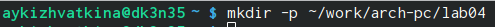{#fig:001 width=70%}

Переходим в созданный каталог. (рис. [-@fig:002]).

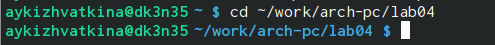{#fig:002 width=70%}

Создаем текстовый файл с именем hello.asm. (рис. [-@fig:003])

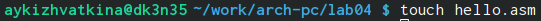{#fig:003 width=70%}

Проверяем создался ли файл. (рис. [-@fig:004])

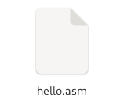{#fig:004 width=70%}

Открываем файл с помощью текстового редактора gedit. (рис. [-@fig:005])

{#fig:005 width=70%}

Вводим необходимый текст.(рис. [-@fig:006])

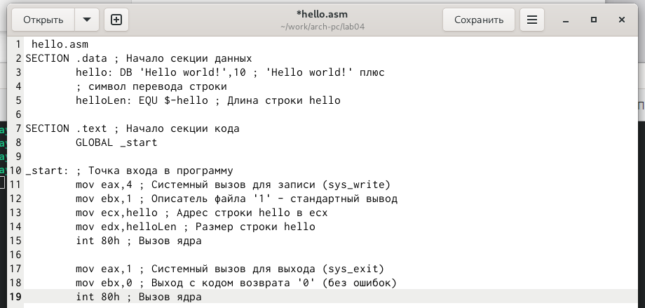{#fig:006 width=70%}

4.2. Транслятор NASM.

Превращаем текст программы в объектный код с помощью транслятора NASM, используя команду nasm -f hello.asm. (рис. [-@fig:007])

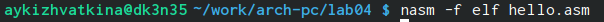{#fig:007 width=70%}

C помощью команды ls проверяем правильность выполнения команды. (рис. [-@fig:008])

{#fig:008 width=70%}

4.3. Работа с расширенным синтаксисом командной строки NASM.

Вводим команду nasm -o obj.o -f elf -g -l list.lst hello.asm, которая компилирует исходный файл hello.asm в odj.o. Также будет создан файл листинга list.lst. С помощью команды ls проверяем правильность выполнение команды. (рис. [-@fig:009]).

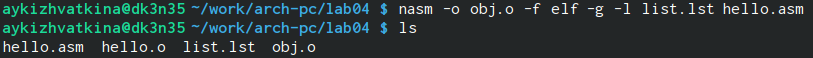{#fig:009 width=70%}

4.4. Работа с компоновщиком LD.

Обрабатываем файл hello.o при помощи компоновщика LD, чтобы получить исходный файл hello. С помощью ls проверяем правильность выполнения команды. (рис. [-@fig:010])

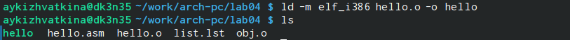{#fig:010 width=70%}

Выполняем следующую команду ld -m elf_i386 obj.o -o main и проверяем правильность выполнения команды. (рис. [-@fig:011])

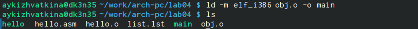{#fig:011 width=70%}

4.5. Запуск исполняемого файла.

Запускаем на выполнение созданный исполняемый файл hello. (рис. [-@fig:012])

{#fig:012 width=70%}

4.6. Выполнение задания для самостоятельной работы.

В каталоге ~/work/arch-pc/lab04 с помощью команды cp создаем копию файла hello.asm с именем lab4.asm. (рис. [-@fig:013])

{#fig:013 width=70%}

Проверяем правльность выполнения команды с помощью ls. (рис. [-@fig:014])

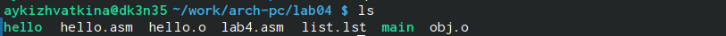{#fig:014 width=70%}

С помощью текстового редактора вносим изменения в текст программы в файле lab4 так, чтобы вместо hello world! на экран выводилось Кижваткина Анна. (рис. [-@fig:015])

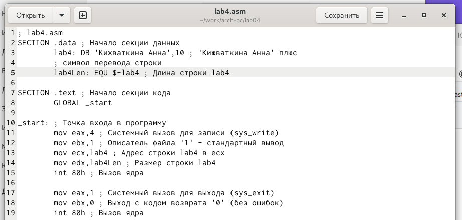{#fig:015 width=70%}

Компилируем текст программы в объектный файл. Проверяем правильность выполнения с помощью ls. (рис. [-@fig:016])

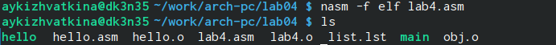{#fig:016 width=70%}

Выполняем компоновку объектного файла. (рис. [-@fig:017])

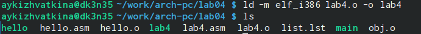{#fig:017 width=70%}

Запускаем получившийся исполняемый файл. (рис. [-@fig:018])

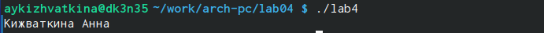{#fig:018 width=70%}

Копируем файлы hello.asm и lab4.asm в Ваш локальный репозиторий в ката-
лог ~/work/study/2023-2024/"Архитектура компьютера"/arch-pc/labs/lab04/. (рис. [-@fig:019])

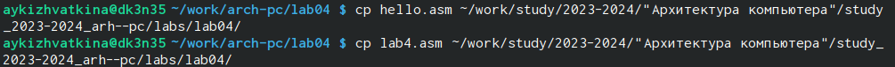{#fig:019 width=70%}

Проверяем правильность выполнения с помощью ls. (рис. [-@fig:020])

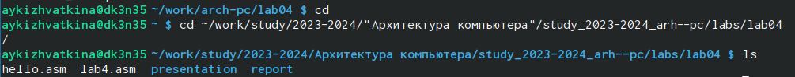{#fig:020 width=70%}

Загружаем файлы на Github при помощи команд git add, git commit и git push. (рис. [-@fig:021] и рис. [-@fig:022])

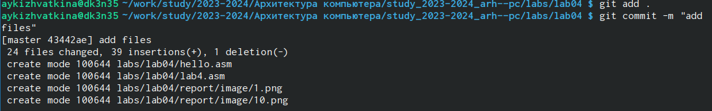{#fig:021 width=70%}

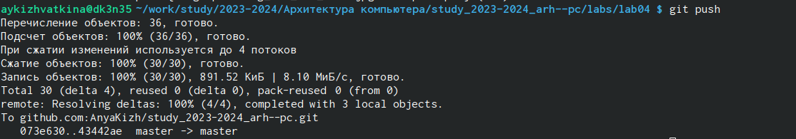{#fig:022 width=70%}

# Выводы

При выполнении данной лабораторной работы мы освоили процедуры компиляции и сборки программ, написанных на ассемблере NASM.

# Список литературы{.unnumbered}

::: {#refs}
:::
