---
## Front matter
title: "Отчёт по лабораторной работе №5"
subtitle: "Дисциплина: Архитектура компьютера"
author: "Кижваткина Анна Юрьевна"

## Generic otions
lang: ru-RU
toc-title: "Содержание"

## Bibliography
bibliography: bib/cite.bib
csl: pandoc/csl/gost-r-7-0-5-2008-numeric.csl

## Pdf output format
toc: true # Table of contents
toc-depth: 2
lof: true # List of figures
lot: true # List of tables
fontsize: 12pt
linestretch: 1.5
papersize: a4
documentclass: scrreprt
## I18n polyglossia
polyglossia-lang:
  name: russian
  options:
	- spelling=modern
	- babelshorthands=true
polyglossia-otherlangs:
  name: english
## I18n babel
babel-lang: russian
babel-otherlangs: english
## Fonts
mainfont: IBM Plex Serif
romanfont: IBM Plex Serif
sansfont: IBM Plex Sans
monofont: IBM Plex Mono
mathfont: STIX Two Math
mainfontoptions: Ligatures=Common,Ligatures=TeX,Scale=0.94
romanfontoptions: Ligatures=Common,Ligatures=TeX,Scale=0.94
sansfontoptions: Ligatures=Common,Ligatures=TeX,Scale=MatchLowercase,Scale=0.94
monofontoptions: Scale=MatchLowercase,Scale=0.94,FakeStretch=0.9
mathfontoptions:
## Biblatex
biblatex: true
biblio-style: "gost-numeric"
biblatexoptions:
  - parentracker=true
  - backend=biber
  - hyperref=auto
  - language=auto
  - autolang=other*
  - citestyle=gost-numeric
## Pandoc-crossref LaTeX customization
figureTitle: "Рис."
tableTitle: "Таблица"
listingTitle: "Листинг"
lofTitle: "Список иллюстраций"
lotTitle: "Список таблиц"
lolTitle: "Листинги"
## Misc options
indent: true
header-includes:
  - \usepackage{indentfirst}
  - \usepackage{float} # keep figures where there are in the text
  - \floatplacement{figure}{H} # keep figures where there are in the text
---

# Цель работы

Целью данной лабораторной работы является приобретение практических навыков работы в Midnight Commander. Освоение инструкций языка ассемблера mov и int.

# Задание

1. Порядок выполнения лабораторной работы.
2. Выполнение самостоятельной работы.

# Теоретическое введение

Midnight Commander, также известный как mc, это программа, которая предоставляет возможность просматривать структуру каталогов и выполнять основные операции управления файловой системой, то есть, mc является файловым менеджером. Midnight Commander облегчает работу с файлами и делает ее более удобной. Программа написана на языке ассемблера NASM и обычно состоит из трех разделов: код программы (SECTION .text), инициализированные данные (SECTION .data) и неинициализированные данные (SECTION .bss). Для объявления данных в разделе .data используются директивы DB, DW, DD, DQ и DT, которые резервируют память и указывают значения, которые должны храниться в этой памяти. Эти директивы используются для объявления переменных и массивов, а для строк обычно применяется директива DB из-за специфики хранения данных в оперативной памяти. Инструкция mov в языке ассемблера используется для копирования данных из одного места в другое.

# Выполнение лабораторной работы

1. Порядок выполнения лабораторной работы.

Открываем mc. (рис. [-@fig:001])

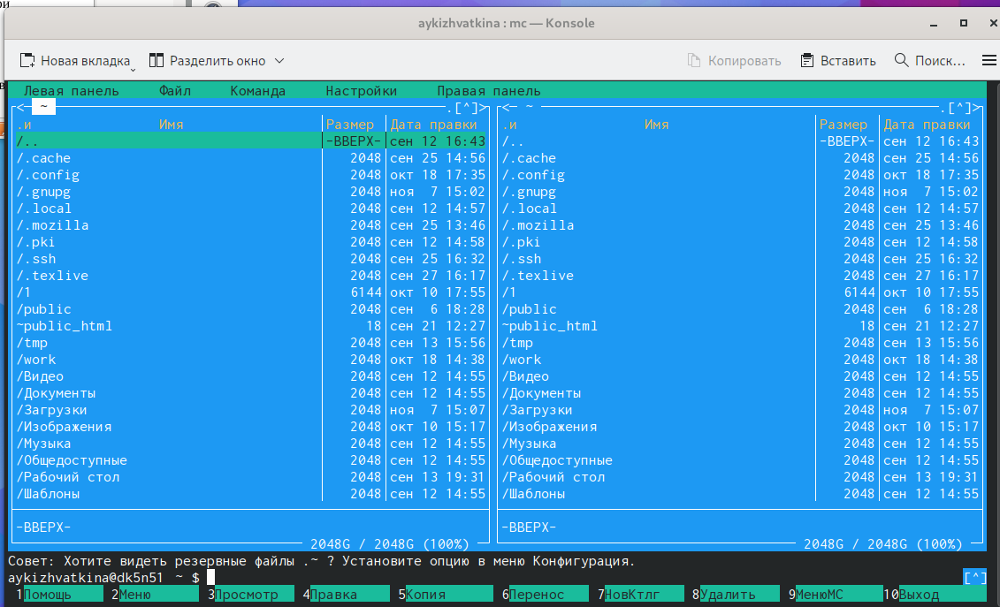{#fig:001 width=70%}

Используя клавиши вверх, вниз и Enter переходим в каталог ~/work/arch-pc, созданный при выполнении работы №4. (рис. [-@fig:002])

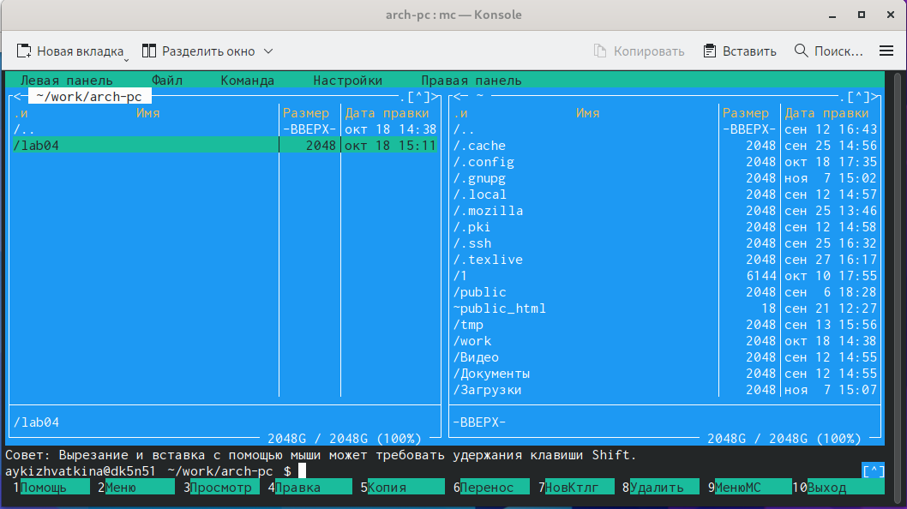{#fig:002 width=70%}

С помощью функциональной клавиши F7 создаем папку lab05. (рис. [-@fig:003])

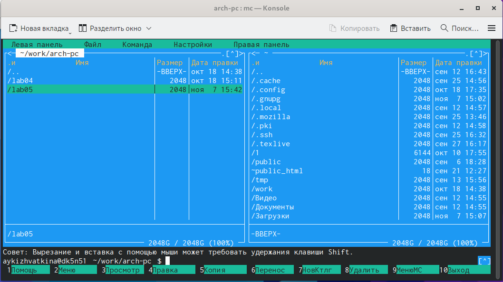{#fig:003 width=70%}

Переходим в созданный каталог. (рис. [-@fig:004])

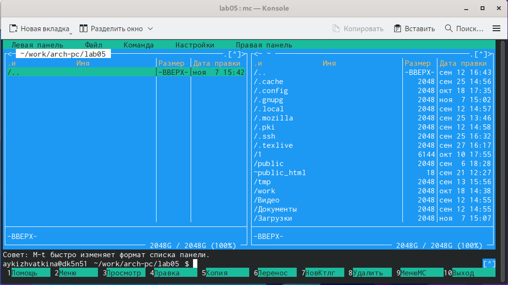{#fig:004 width=70%}

Пользуясь строкой ввода и командой touch создаем файл lab5-1.asm. (рис. [-@fig:005])

{#fig:005 width=70%}

С помощью функциональной клавши F4 открываем файл lab5-1.asm для редактирования во встроенном редакторе. Используем редактор nano или mcedit. Вводим текст программы из листинга 5.1. (рис. [-@fig:006])

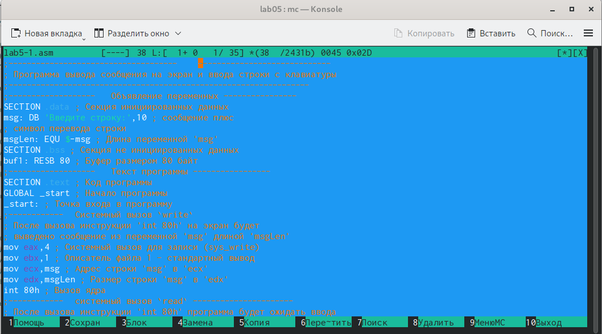{#fig:006 width=70%}

Сохраняем изменения и закрываем файл. (рис. [-@fig:007])

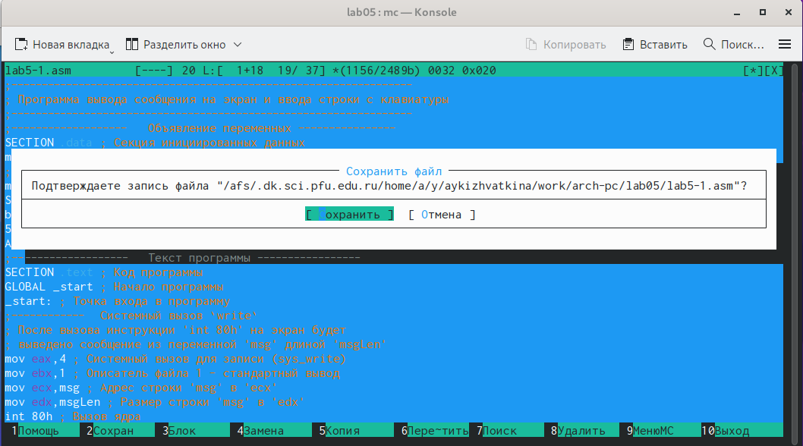{#fig:007 width=70%}

С помощью функциональной клавиши F3 откройте файл lab5-1.asm для просмотра. Проверяем, что файл содержит текст программы. (рис. [-@fig:008])

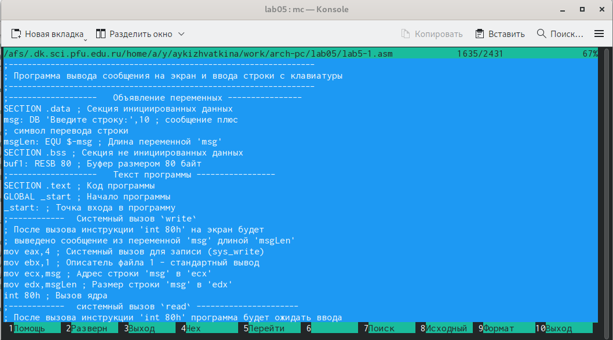{#fig:008 width=70%}

Оттранслируем текст программы lab5-1.asm в объектный файл. Выполняем компоновку объектного файла и запускаем получившийся исполняемый файл. Программа выводит строку 'Введите строку:' и ожидает ввода с клавиатуры. На запрос введите наше ФИО. (рис. [-@fig:009])

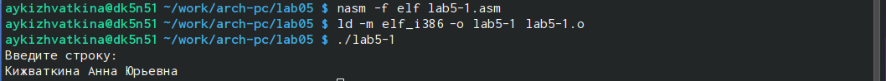{#fig:009 width=70%}

Скачиваем файл in_out.asm. Копируем файл в тот же каталог, что и файл с программой. (рис. [-@fig:010])

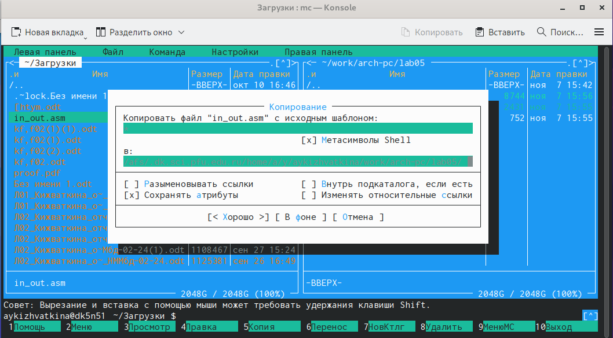{#fig:010 width=70%}

С помощью функциональной клавиши F6 создаем копию файла  lab5-1.asm с именем  lab5-2.asm. (рис. [-@fig:011])

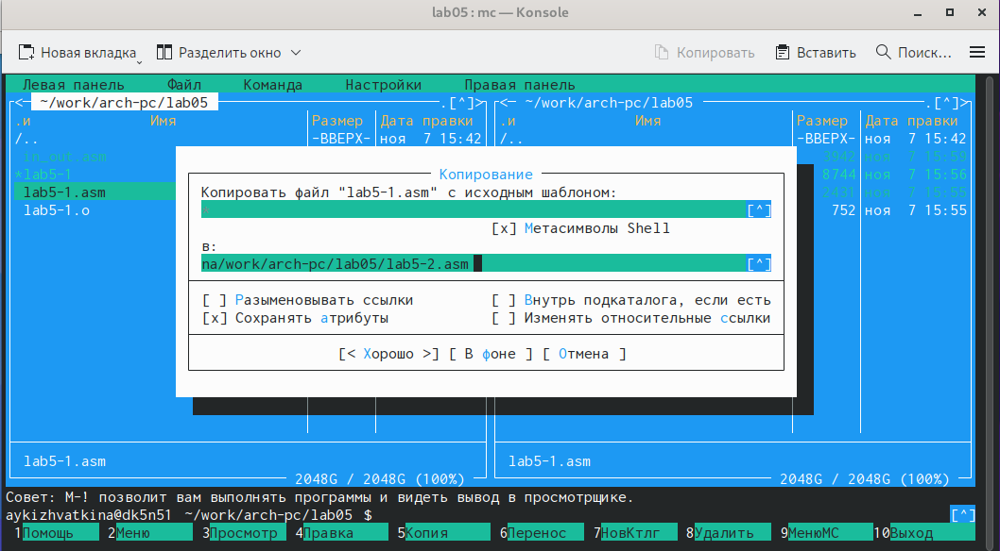{#fig:011 width=70%}

Исправляем текст программы в файле lab5-2.asm с использованием подпрограмм из внешнего файла in_out.asm, используя подпрограммы sprintLF, sread и quit. (рис. [-@fig:012])

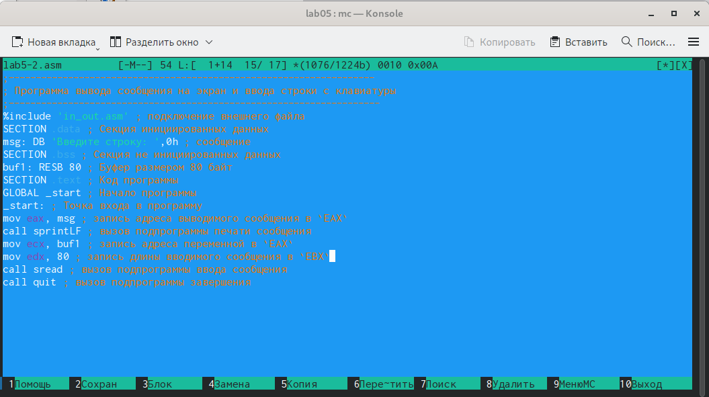{#fig:012 width=70%}

Создаем исполняемый файл и проверяем его работы. (рис. [-@fig:013])

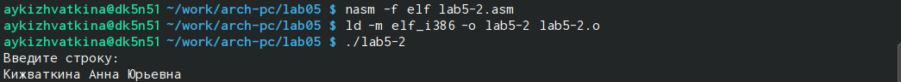{#fig:013 width=70%}

В файле lab5-2.asm заменяем подпрограмму sprintLF на sprint и сохраняем. (рис. [-@fig:014])

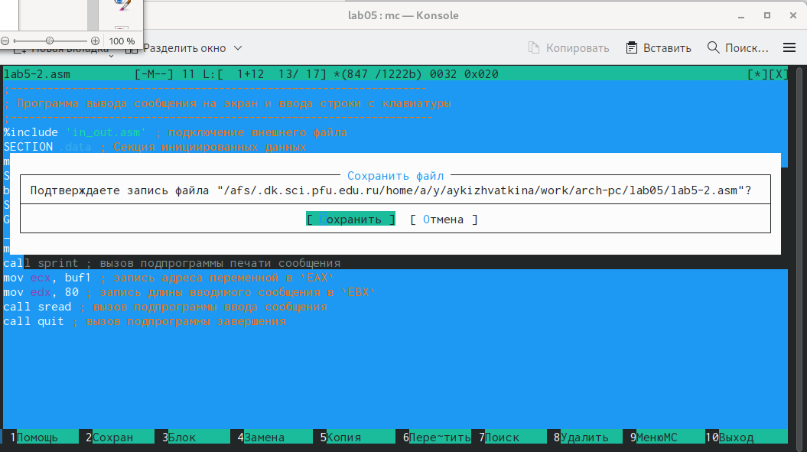{#fig:014 width=70%}

Создаем файл и проверяем его работу. (рис. [-@fig:015])

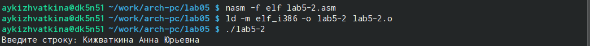{#fig:015 width=70%}

Разница в том что sprintLF переносит на новую строку, а с sprint нужно вводить на той же строке.

2. Выполнение самостоятельной работы.

Создаем копию файла lab5-1.asm. (рис. [-@fig:016])

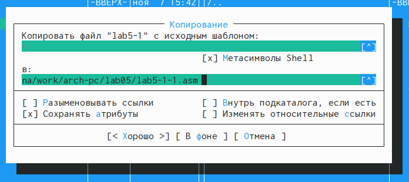{#fig:016 width=70%}

Вносим изменения в программу(без использования внешнего файла in_out.asm) (рис. [-@fig:017])

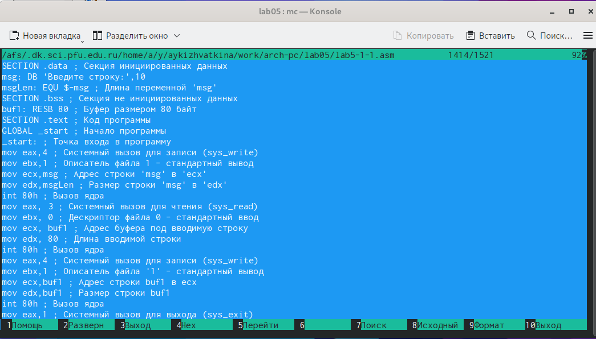{#fig:017 width=70%}

Получаем исполнительный файл. Проверяем правильность выполнения. На приглашение ввести строку вводим свою фамилию. (рис. [-@fig:018])

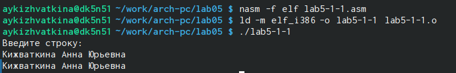{#fig:018 width=70%}

Создаем копию файла lab5-2.asm. (рис. [-@fig:019])

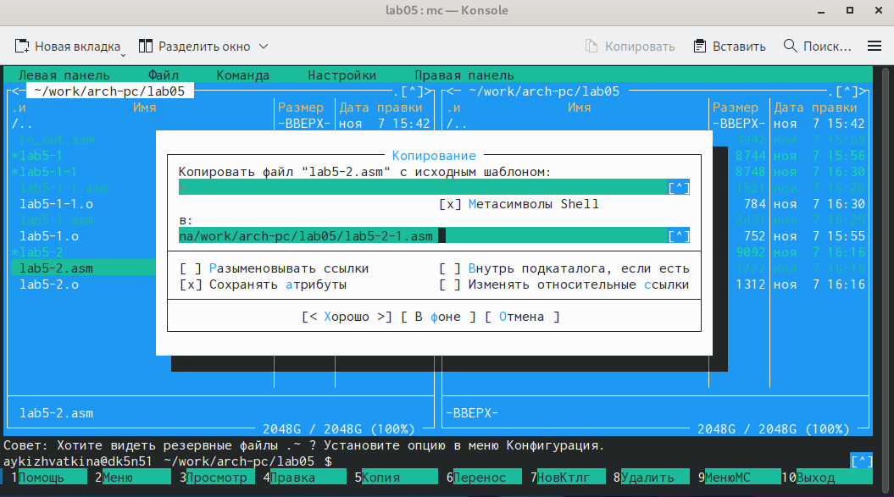{#fig:019 width=70%}

Исправляем текст программы с использованием программ из внешнего файла in_out.asm. (рис. [-@fig:020])

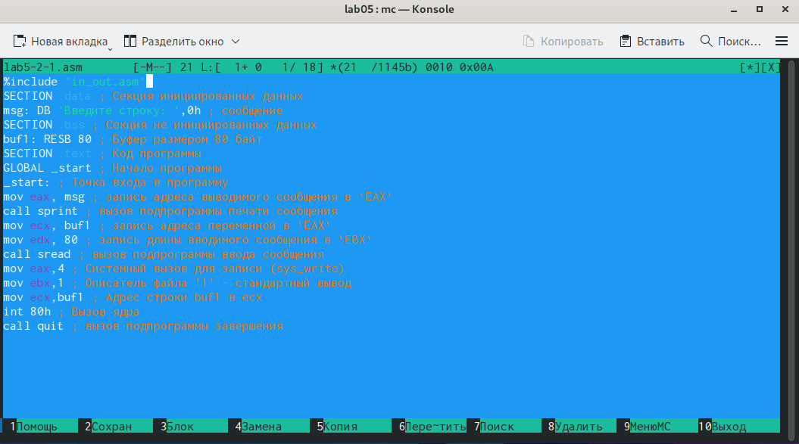{#fig:020 width=70%}

Создаем исполняемый файл и проверяем его работу. (рис. [-@fig:021])

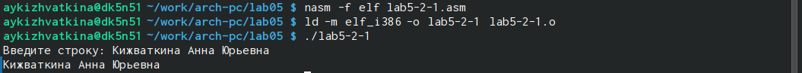{#fig:021 width=70%}

# Выводы

При выполнении данной лабораторной работы я приобрела практические навыки работы в Midnight Commander, а также освоила инструкции языка ассемблера mov и int.

