---
## Front matter
title: "Отчёт по лабораторной работе № 6"
subtitle: "Дисциплина: Архитектура компьютера"
author: "Кижваткина Анна Юрьевна"

## Generic otions
lang: ru-RU
toc-title: "Содержание"

## Bibliography
bibliography: bib/cite.bib
csl: pandoc/csl/gost-r-7-0-5-2008-numeric.csl

## Pdf output format
toc: true # Table of contents
toc-depth: 2
lof: true # List of figures
lot: true # List of tables
fontsize: 12pt
linestretch: 1.5
papersize: a4
documentclass: scrreprt
## I18n polyglossia
polyglossia-lang:
  name: russian
  options:
	- spelling=modern
	- babelshorthands=true
polyglossia-otherlangs:
  name: english
## I18n babel
babel-lang: russian
babel-otherlangs: english
## Fonts
mainfont: IBM Plex Serif
romanfont: IBM Plex Serif
sansfont: IBM Plex Sans
monofont: IBM Plex Mono
mathfont: STIX Two Math
mainfontoptions: Ligatures=Common,Ligatures=TeX,Scale=0.94
romanfontoptions: Ligatures=Common,Ligatures=TeX,Scale=0.94
sansfontoptions: Ligatures=Common,Ligatures=TeX,Scale=MatchLowercase,Scale=0.94
monofontoptions: Scale=MatchLowercase,Scale=0.94,FakeStretch=0.9
mathfontoptions:
## Biblatex
biblatex: true
biblio-style: "gost-numeric"
biblatexoptions:
  - parentracker=true
  - backend=biber
  - hyperref=auto
  - language=auto
  - autolang=other*
  - citestyle=gost-numeric
## Pandoc-crossref LaTeX customization
figureTitle: "Рис."
tableTitle: "Таблица"
listingTitle: "Листинг"
lofTitle: "Список иллюстраций"
lotTitle: "Список таблиц"
lolTitle: "Листинги"
## Misc options
indent: true
header-includes:
  - \usepackage{indentfirst}
  - \usepackage{float} # keep figures where there are in the text
  - \floatplacement{figure}{H} # keep figures where there are in the text
---

# Цель работы

Целью данной лабораторной работы является освоение арифметических инструкций языка ассемблера NASM.

# Задание

1. Символьные и численные данные в NASM.
2. Выполнение арифметических операций в NASM.
3. Выполнение самостоятельной работы.

# Теоретическое введение

Большинство указаний на языке ассемблера требуют обработки операндов. Адрес операнда указывает на место, где хранятся данные, которые необходимо обработать. Эти данные могут быть хранящимися в регистре или ячейке памяти.

Адресация по регистрам – данные хранятся в регистрах, и в команде используются имена этих регистров, например: mov ax, bx.

Непосредственная адресация – значение операнда указывается непосредственно в команде, например: mov ax, 2.

Адресация памяти – операнд указывает адрес в памяти. В команде указывается символическое обозначение ячейки памяти, над содержимым которой нужно выполнить операцию.

Ввод информации с клавиатуры и вывод ее на экран происходит в символьном виде в соответствии с таблицей символов ASCII.

Согласно стандарту ASCII, каждый символ кодируется одним байтом. Среди инструкций NASM отсутствует инструкция для вывода чисел (не в символьном виде). Поэтому для вывода чисел нужно сначала преобразовать цифры в ASCII-коды и выводить на экран эти коды, а не сами числа.

Подобная ситуация возникает и при вводе данных с клавиатуры – введенные данные будут представлять символы, что затрудняет арифметические операции с ними. Для решения этой проблемы необходимо преобразовать ASCII символы в числа и наоборот.

# Выполнение лабораторной работы

1. Символьные и численные данные в NASM.

Создаем каталог для программ лабораторной работы №6 (рис. [-@fig:001]).

{#fig:001 width=70%}

Переходим в созданный каталог. (рис. [-@fig:002]).

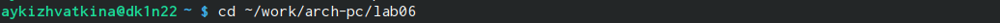{#fig:002 width=70%}

Создаем файл lab6-1.asm. (рис. [-@fig:003]).

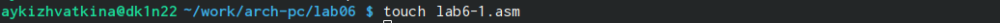{#fig:003 width=70%}

Рассмотрим примеры программ вывода символьных и численных значений. Вводим в файле программу с листинга 6.1 (рис. [-@fig:004]).

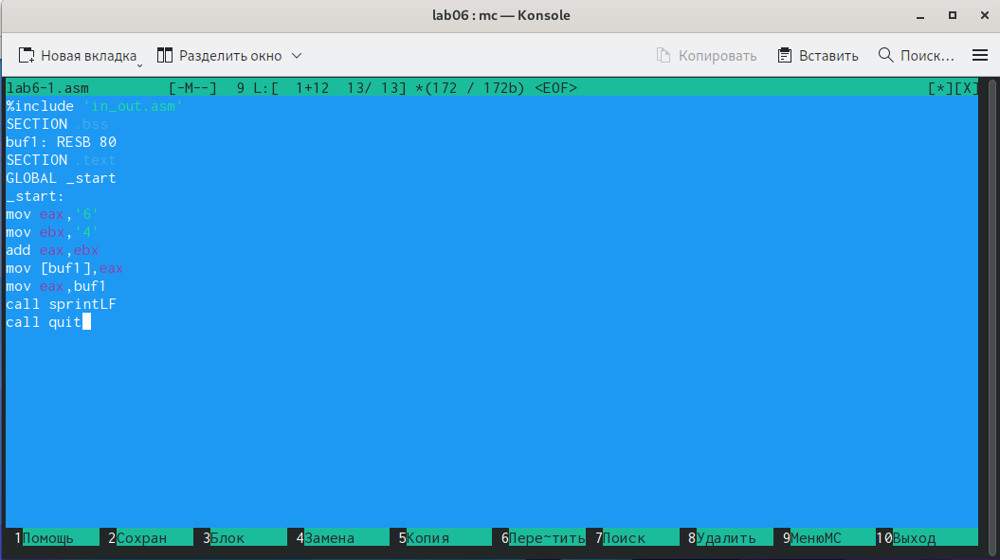{#fig:004 width=70%}

Скачиваем и переносим файл in_out.asm в каталог лабораторной работы 6. (рис. [-@fig:005]).

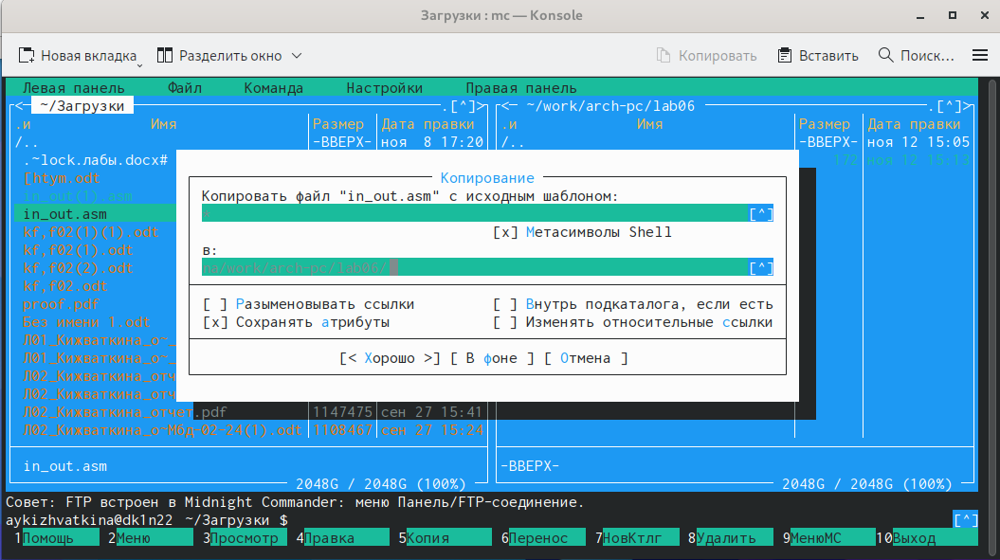{#fig:005 width=70%}

Создаем исполняемый файл и запускаем его. Программа выводи символ j так как программа выводит символ, соответствующий сумме двоичных кодов 6 и 4. (рис. [-@fig:006]).

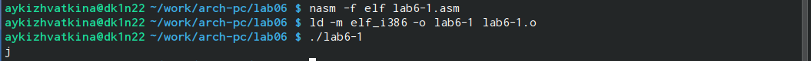{#fig:006 width=70%}

Изменяем в тексте программы символы ‘6’ и ’4’ на 6 и 4. (рис. [-@fig:007]).

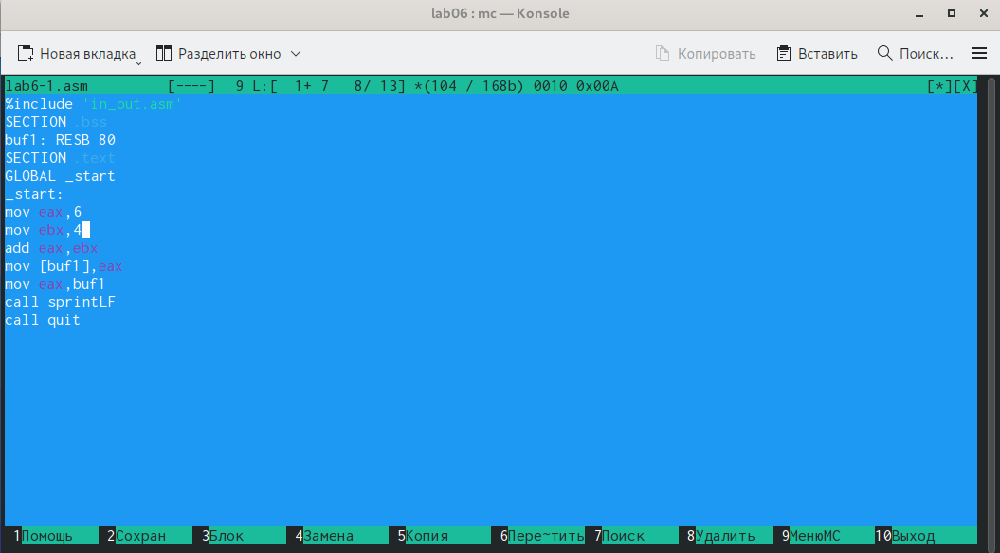{#fig:007 width=70%}

Создаем исполняемый файл и запускаем его. Теперь вывелся символ с кодом 10. Это символ перевода строки, он не отображается на экране. (рис. [-@fig:008]).

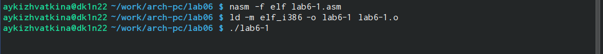{#fig:008 width=70%}

Создаем файл lab6-2.asm. (рис. [-@fig:009]).

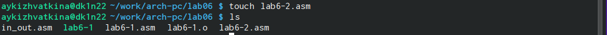{#fig:009 width=70%}

Вводим в файл текст программы из листинга 6.2. (рис. [-@fig:010]).

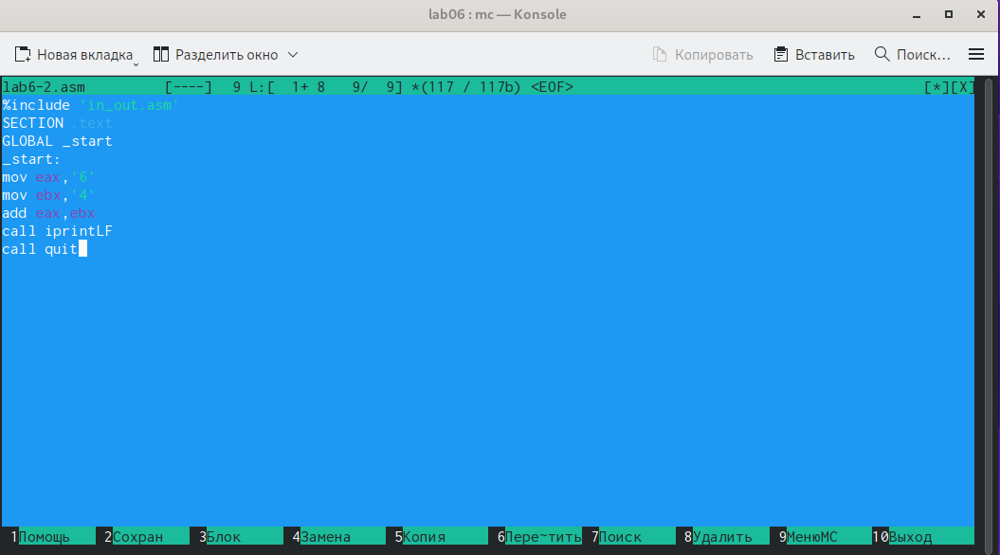{#fig:010 width=70%}

Создаем исполняемый файл и запускаем его. В результате работы программы мы получим число 106 т.к команда add складывает коды символов, но функция iprintLF позволяет вывести число, а не символ, кодом которого является это число. (рис. [-@fig:011]).

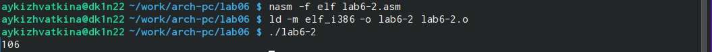{#fig:011 width=70%}

Изменяем в тексте программы символы ‘6’ и ’4’ на 6 и 4. (рис. [-@fig:012]).

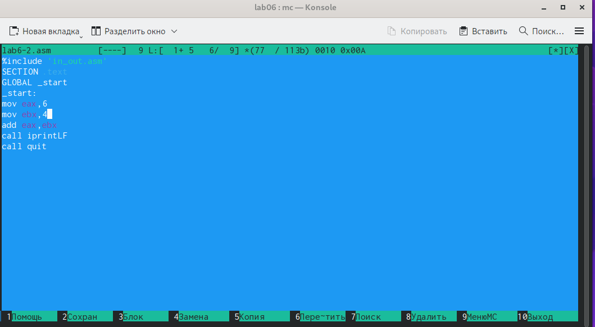{#fig:012 width=70%}

Создаем исполняемый файл и запускаем его. Теперь программа складывает не коды, а сами числа, поэтому результатом является число 10. (рис. [-@fig:013]).

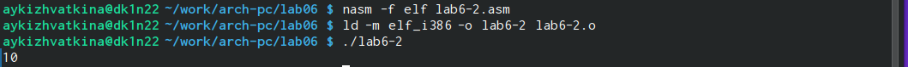{#fig:013 width=70%}

Заменяем в тексте программы функцию iprintLF на iprint. (рис. [-@fig:014]).

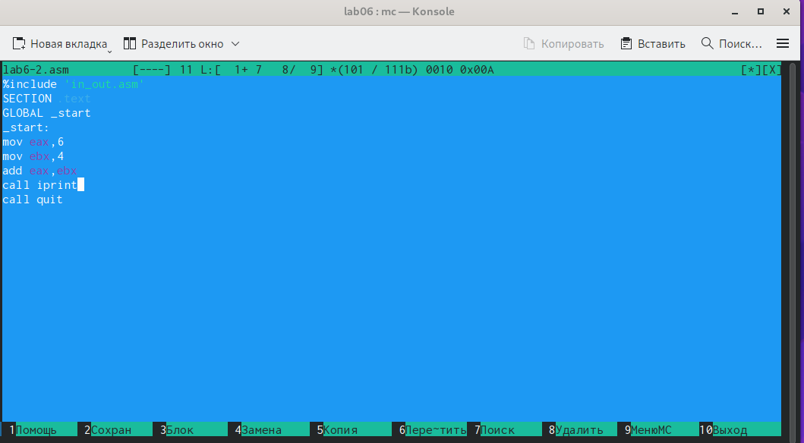{#fig:014 width=70%}

Создаем исполняемый файл и запускаем его. Вывод не изменился, но символ переноса строки не отображается. (рис. [-@fig:015]).

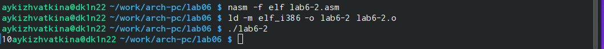{#fig:015 width=70%}

2. Выполнение арифметических операций в NASM.

Создаем файл lab6-3.asm. (рис. [-@fig:016]).

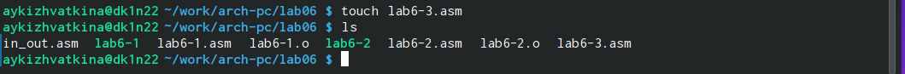{#fig:016 width=70%}

Вводим в созданный файл текст программы из листинга 6.3. (рис. [-@fig:017]).

{#fig:017 width=70%}

Создаем исполняемый файл и запускаем его. (рис. [-@fig:018]).

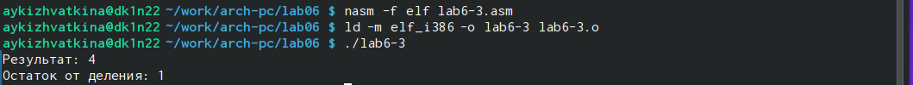{#fig:018 width=70%}

Изменяем текст программы для вычисления выражения. (рис. [-@fig:019]).

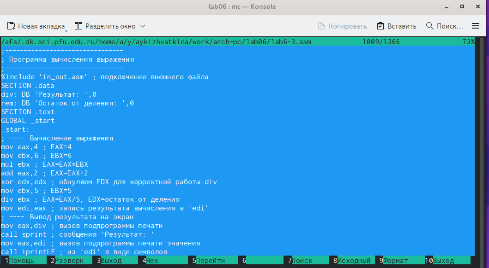{#fig:019 width=70%}

Создаем исполняемый файл и проверяем его работу. (рис. [-@fig:020]).

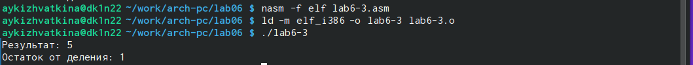{#fig:020 width=70%}

Создаем файл variant.asm с помощью touch. (рис. [-@fig:021]).

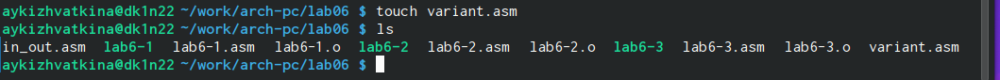{#fig:021 width=70%}

Вводим в файл текст программы из листинга 6.4. (рис. [-@fig:022]).

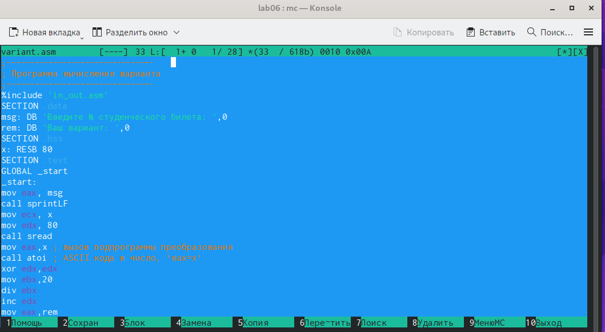{#fig:022 width=70%}

Создаем и запускаем исполняемый файл. Вводим номер своего студенческого билета проверяем выведенный ответ аналитически. (рис. [-@fig:023]).

{#fig:023 width=70%}

Ответы на вопросы: 

1. За вывод сообщения «Ваш вариант» отвечает данная строка:
```
mov eax,rem
call sprint 
```
2. Инструкция mov ecx,x используется, чтобы положить адрес вводимой строки x в регистр ecx mov edx,80 – запись регистр edx длины вводимой строки call spread – вызов подпрограммы из внешнего файла, обеспечивающей ввод сообщения с клавиатуры. 

3. Call atoi используется для вызова подпрограммы из внешнего файла, которая преобразует asci-код символа в целое число и записывает результат в регистр eax. 

4. За вычисление варианта отвечают данные строки:
```
xor edx,edx
mov ebx,20
div ebx
inc edx
```
5. При выполнении инструкции div ebx остаток от деления записывается в регистр edx.
 
6. Инструкция inc edx увеличивает значение регистра edx на 1.

7. За вывод результата на экран отвечают данные строки:
```
mov eax,edx
call iprintLF
```
3. Выполнение самостоятельной работы.

Создаем файл lab6-4 с помощью touch. (рис. [-@fig:024]).

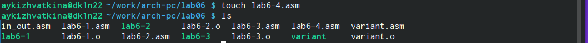{#fig:024 width=70%}

Вводим в файл текст программы для вычисления выражения под номером 18. (рис. [-@fig:025]).

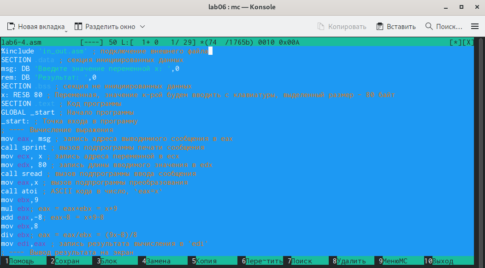{#fig:025 width=70%}

Создаем и запускаем файл. Проверяем оба значения. (рис. [-@fig:026]).

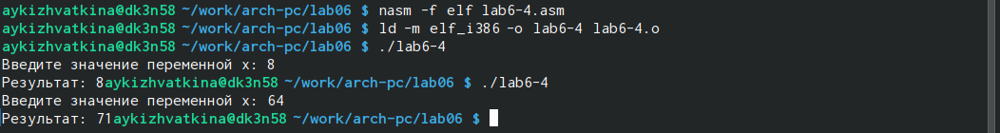{#fig:026 width=70%}

# Выводы

С помощью данной лабораторной работы мы освоили арифметические инструкции языка ассемблера NASM.

