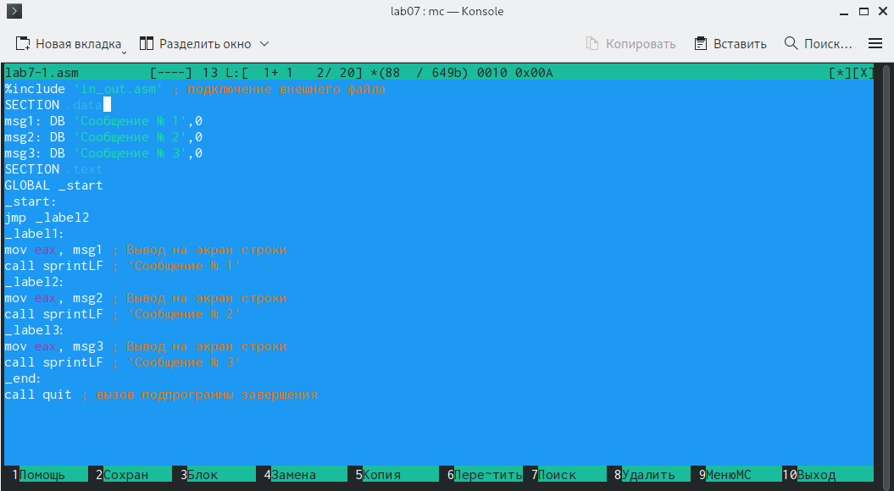

---
## Front matter
title: "Отчёт по лабораторной работе №7"
subtitle: "Дисциплина: архитектура компьютера"
author: "Анна Юрьевна Кижваткина"

## Generic otions
lang: ru-RU
toc-title: "Содержание"

## Bibliography
bibliography: bib/cite.bib
csl: pandoc/csl/gost-r-7-0-5-2008-numeric.csl

## Pdf output format
toc: true # Table of contents
toc-depth: 2
lof: true # List of figures
lot: true # List of tables
fontsize: 12pt
linestretch: 1.5
papersize: a4
documentclass: scrreprt
## I18n polyglossia
polyglossia-lang:
  name: russian
  options:
	- spelling=modern
	- babelshorthands=true
polyglossia-otherlangs:
  name: english
## I18n babel
babel-lang: russian
babel-otherlangs: english
## Fonts
mainfont: IBM Plex Serif
romanfont: IBM Plex Serif
sansfont: IBM Plex Sans
monofont: IBM Plex Mono
mathfont: STIX Two Math
mainfontoptions: Ligatures=Common,Ligatures=TeX,Scale=0.94
romanfontoptions: Ligatures=Common,Ligatures=TeX,Scale=0.94
sansfontoptions: Ligatures=Common,Ligatures=TeX,Scale=MatchLowercase,Scale=0.94
monofontoptions: Scale=MatchLowercase,Scale=0.94,FakeStretch=0.9
mathfontoptions:
## Biblatex
biblatex: true
biblio-style: "gost-numeric"
biblatexoptions:
  - parentracker=true
  - backend=biber
  - hyperref=auto
  - language=auto
  - autolang=other*
  - citestyle=gost-numeric
## Pandoc-crossref LaTeX customization
figureTitle: "Рис."
tableTitle: "Таблица"
listingTitle: "Листинг"
lofTitle: "Список иллюстраций"
lotTitle: "Список таблиц"
lolTitle: "Листинги"
## Misc options
indent: true
header-includes:
  - \usepackage{indentfirst}
  - \usepackage{float} # keep figures where there are in the text
  - \floatplacement{figure}{H} # keep figures where there are in the text
---

# Цель работы

Целью данной лабораторной работы является изучение команд условного и безусловного переходов. Приобретение навыков написания программ с использованием переходов. Знакомство с назначением и структурой файла листинга. 

# Задание

1. Реализация переходов в NASM.
2. Изучение структуры файлы листинга.
3. Выполнение самостоятельной работы.

# Выполнение лабораторной работы

Создаем каталог для программ лабораторной работы №7. (рис. [-@fig:001]).

{#fig:001 width=70%}

Переходим в созданный каталог. (рис. [-@fig:002]).

{#fig:002 width=70%}

Создаем файл lab7-1.asm. Проверяем наличие. (рис. [-@fig:003]).

{#fig:003 width=70%}

Вводим в файл программу из листинга 7.1. (рис. [-@fig:004]).

{#fig:004 width=70%}

Создаем исполняемый файл и запускаем его. (рис. [-@fig:005]).

{#fig:005 width=70%}

Вводим в файл программу из листинга 7.2 и меняем её так чтобы выводилось сначала 2 а потом 1 сообщение. (рис. [-@fig:006]).

{#fig:006 width=70%}

Создаем исполняемый файл и запускаем его. (рис. [-@fig:007]).

{#fig:007 width=70%}

Меняем программу так чтобы выводилось сначала 3, потом 2, а потом 1 сообщение. (рис. [-@fig:008]).

{#fig:008 width=70%}

Создаем исполняемый файл и запускаем его. (рис. [-@fig:009]).

{#fig:009 width=70%}

Создаем файл lab7-2.asm. Проверяем наличие. (рис. [-@fig:010]).

{#fig:010 width=70%}

Вводим в файл программу из листинга 7.3. (рис. [-@fig:011]).

{#fig:011 width=70%}

Создаем исполняемый файл и проверяем его работу для разных значений. (рис. [-@fig:012]).

{#fig:012 width=70%}

Создаем файл листинга. (рис. [-@fig:013]).

{#fig:013 width=70%}

Открываем файл листинга с помощью mcedit. 1(рис. [-@fig:014]).

{#fig:014 width=70%}

Данная строка присваивает eax значение max. (рис. [-@fig:015]).

{#fig:015 width=70%}

Данная строка выводит текст и переходит на другую строку. (рис. [-@fig:016]).

{#fig:016 width=70%}

Данная строка выводит ответ. (рис. [-@fig:017]).

{#fig:017 width=70%}

Открываем файл с программой lab7-2.asm и в любой инструкции с двумя операндами удалить один операнд. (рис. [-@fig:018]).

{#fig:018 width=70%}

Выполняем трансляцию с получением файла листинга. (рис. [-@fig:019]).

{#fig:019 width=70%}

Мы получаем листинг с ошибкой. (рис. [-@fig:020]).

{#fig:020 width=70%}

Создаем файл lab7-3.asm. (рис. [-@fig:021]).

{#fig:021 width=70%}

Вводим программу для вычисления наименьшей целочисленной переменной. Мой вариант 5, поэтому мои числа 54, 62 и 87. (рис. [-@fig:022]).
 
{#fig:022 width=70%}

Создаем исполняемый файл и запускаем его. (рис. [-@fig:023]).

{#fig:023 width=70%}

Создаем файл lab7-4.asm. (рис. [-@fig:024]).

{#fig:024 width=70%}

Вводим программу для вычисления значения заданной функции. Мой вариант 5. (рис. [-@fig:025]).

{#fig:025 width=70%}

Создаем исполняемый файл и запускаем его. (рис. [-@fig:026]).

{#fig:026 width=70%}

# Выводы

С помощью данной лабораторной работы мы изучили команды условного и безусловного переходов. Приобрели навыки написания программ с использованием переходов. Ознакомились с назначением и структурой файла листинга.
