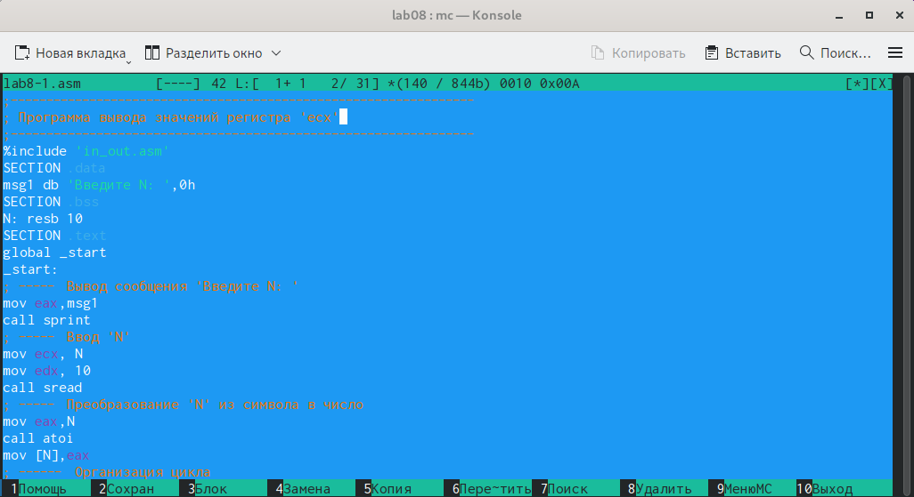

---
## Front matter
title: "Отчёта по лабораторной работе №8"
subtitle: "Дисциплина: Архитектура компьютера"
author: "Кижваткина Анна Юрьевна"

## Generic otions
lang: ru-RU
toc-title: "Содержание"

## Bibliography
bibliography: bib/cite.bib
csl: pandoc/csl/gost-r-7-0-5-2008-numeric.csl

## Pdf output format
toc: true # Table of contents
toc-depth: 2
lof: true # List of figures
lot: true # List of tables
fontsize: 12pt
linestretch: 1.5
papersize: a4
documentclass: scrreprt
## I18n polyglossia
polyglossia-lang:
  name: russian
  options:
	- spelling=modern
	- babelshorthands=true
polyglossia-otherlangs:
  name: english
## I18n babel
babel-lang: russian
babel-otherlangs: english
## Fonts
mainfont: IBM Plex Serif
romanfont: IBM Plex Serif
sansfont: IBM Plex Sans
monofont: IBM Plex Mono
mathfont: STIX Two Math
mainfontoptions: Ligatures=Common,Ligatures=TeX,Scale=0.94
romanfontoptions: Ligatures=Common,Ligatures=TeX,Scale=0.94
sansfontoptions: Ligatures=Common,Ligatures=TeX,Scale=MatchLowercase,Scale=0.94
monofontoptions: Scale=MatchLowercase,Scale=0.94,FakeStretch=0.9
mathfontoptions:
## Biblatex
biblatex: true
biblio-style: "gost-numeric"
biblatexoptions:
  - parentracker=true
  - backend=biber
  - hyperref=auto
  - language=auto
  - autolang=other*
  - citestyle=gost-numeric
## Pandoc-crossref LaTeX customization
figureTitle: "Рис."
tableTitle: "Таблица"
listingTitle: "Листинг"
lofTitle: "Список иллюстраций"
lotTitle: "Список таблиц"
lolTitle: "Листинги"
## Misc options
indent: true
header-includes:
  - \usepackage{indentfirst}
  - \usepackage{float} # keep figures where there are in the text
  - \floatplacement{figure}{H} # keep figures where there are in the text
---

# Цель работы

Целью данной лабораторной работы является приобретение навыков написания программ с использованием циклов и обработкой аргументов командной строки.

# Задание

1. Реализация циклов в NASM.
2. Обработка аргументов командной строки.
3. Выполнение лабораторной работы.

# Выполнение лабораторной работы

Создаем каталог для программ лабораторной работы №8. (рис. [-@fig:001]).

{#fig:001 width=70%}

Переходим в созданный каталог. (рис. [-@fig:002]).

{#fig:002 width=70%}

Создаем файл lab8-1.asm. Проверяем наличие. (рис. [-@fig:003]).

{#fig:003 width=70%}

Вводим в файл программу из листинга 8.1. (рис. [-@fig:004]).

{#fig:004 width=70%}

Создаем исполняемый файл и запускаем его. (рис. [-@fig:005]).

{#fig:005 width=70%}

Меняем label в программе согласно тексту. (рис. [-@fig:006]).

{#fig:006 width=70%}

Создаем исполняемый файл и запускаем его. (рис. [-@fig:007]).

{#fig:007 width=70%}

Цикл закольцевался и стал бесконечным.

Меняем label в программе согласно тексту. (рис. [-@fig:008]).

{#fig:008 width=70%}

В данной ситуации циклы нумеруются с 0. Число проходов совпадает с введенным значением N.

Создаем исполняемый файл и запускаем его. (рис. [-@fig:009]).

{#fig:009 width=70%}

Создаем файл lab8-1.asm. Проверяем наличие. (рис. [-@fig:010]).

{#fig:010 width=70%}

Вводим в файл программу из листинга 8.2. (рис. [-@fig:011]).

{#fig:011 width=70%}

Создаем исполняемый файл и запускаем его. (рис. [-@fig:012]).

{#fig:012 width=70%}

Программа выводит все 3 аргумента которые ввели, но в разной вариации.

Создаем файл lab8-1.asm. Проверяем наличие. (рис. [-@fig:013]).

{#fig:013 width=70%}

Вводим в файл программу из листинга 8.3. (рис. [-@fig:014]).

{#fig:014 width=70%}

Создаем исполняемый файл и запускаем его. (рис. [-@fig:015]).

{#fig:015 width=70%}

Изменяем программу, чтобы вместо суммы было произведение. (рис. [-@fig:016]).

{#fig:016 width=70%}

Создаем исполняемый файл и запускаем его. (рис. [-@fig:017]).

{#fig:017 width=70%}

Создаем файл lab8-1.asm. Проверяем наличие. (рис. [-@fig:018]).

{#fig:018 width=70%}

Пишем программу(рис. [-@fig:019]).

{#fig:019 width=70%}

Создаем исполняемый файл и запускаем его. (рис. [-@fig:020]).

{#fig:020 width=70%}

# Выводы

С помощью данной лабораторной работы приобрели навыки написания программ с использованием циклов и обработкой аргументов командной строки.
