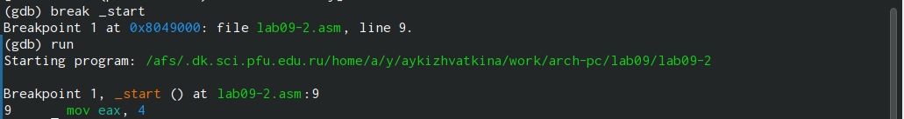
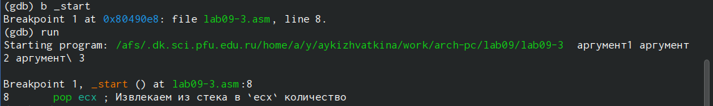

---
## Front matter
title: "Отчёт по лабораторной работе"
subtitle: "Дисциплина: Архитектура компьютера"
author: "Кижваткина Анна Юрьевна"

## Generic otions
lang: ru-RU
toc-title: "Содержание"

## Bibliography
bibliography: bib/cite.bib
csl: pandoc/csl/gost-r-7-0-5-2008-numeric.csl

## Pdf output format
toc: true # Table of contents
toc-depth: 2
lof: true # List of figures
lot: true # List of tables
fontsize: 12pt
linestretch: 1.5
papersize: a4
documentclass: scrreprt
## I18n polyglossia
polyglossia-lang:
  name: russian
  options:
	- spelling=modern
	- babelshorthands=true
polyglossia-otherlangs:
  name: english
## I18n babel
babel-lang: russian
babel-otherlangs: english
## Fonts
mainfont: IBM Plex Serif
romanfont: IBM Plex Serif
sansfont: IBM Plex Sans
monofont: IBM Plex Mono
mathfont: STIX Two Math
mainfontoptions: Ligatures=Common,Ligatures=TeX,Scale=0.94
romanfontoptions: Ligatures=Common,Ligatures=TeX,Scale=0.94
sansfontoptions: Ligatures=Common,Ligatures=TeX,Scale=MatchLowercase,Scale=0.94
monofontoptions: Scale=MatchLowercase,Scale=0.94,FakeStretch=0.9
mathfontoptions:
## Biblatex
biblatex: true
biblio-style: "gost-numeric"
biblatexoptions:
  - parentracker=true
  - backend=biber
  - hyperref=auto
  - language=auto
  - autolang=other*
  - citestyle=gost-numeric
## Pandoc-crossref LaTeX customization
figureTitle: "Рис."
tableTitle: "Таблица"
listingTitle: "Листинг"
lofTitle: "Список иллюстраций"
lotTitle: "Список таблиц"
lolTitle: "Листинги"
## Misc options
indent: true
header-includes:
  - \usepackage{indentfirst}
  - \usepackage{float} # keep figures where there are in the text
  - \floatplacement{figure}{H} # keep figures where there are in the text
---

# Цель работы

Целью данной лабораторной работы является приобретение навыков написания программ с использованием подпрограмм. Знакомство с методами отладки при помощи GDB и его основными возможностями.

# Задание

1. Реализация подпрограмм в NASM. 
2. Отладка программ с помощью GDB. 
2.1.  Добавление точек останова.
2.2. Работа с данными программы в GDB.
2.3. Обработка аргументов командной строки в GDB.
3. Выполнение самостоятельной работы.

# Выполнение лабораторной работы

Создаем каталог. (рис. [-@fig:001]).

{#fig:001 width=70%}

Перемещаемся в созданный каталог. (рис. [-@fig:002]).

{#fig:002 width=70%}

Создаем файл и проверяем его наличие. (рис. [-@fig:003]).

{#fig:003 width=70%}

Вводим текст программы листинга. (рис. [-@fig:004]).

{#fig:004 width=70%}

Создаем исполняемый файл и запускаем его. (рис. [-@fig:005]).

{#fig:005 width=70%}

Изменяем текст программы так, чтобы она решала f(g(x)). (рис. [-@fig:006]).

{#fig:006 width=70%}

Создаем исполняемый файл и запускаем его. (рис. [-@fig:007]).

{#fig:007 width=70%}

Создаем файл и проверяем его наличие. (рис. [-@fig:008]).

{#fig:008 width=70%}

Вписываем в файл программу. (рис. [-@fig:009]).

{#fig:009 width=70%}

Создаем исполняемый файл. (рис. [-@fig:010]).

{#fig:010 width=70%}

Запуск программы в отладчик gdb. (рис. [-@fig:011] и рис. [-@fig:012]).

{#fig:011 width=70%}

{#fig:012 width=70%}

Ставим брейк на _start. (рис. [-@fig:013]).

{#fig:013 width=70%}

Смотрим код программы начиная с _start. (рис. [-@fig:014]).

{#fig:014 width=70%}

Переключаемся на отображение команд с Intel’овским синтаксисом, введя команду set
disassembly-flavor intel. В режиме АТТ отображаются знаки % и $, а в intel нет. (рис. [-@fig:015]).

{#fig:015 width=70%}

Включаем режим псевдографики. (рис. [-@fig:016]).

{#fig:016 width=70%}

Проверяем наличие меток. (рис. [-@fig:017]).

{#fig:017 width=70%}

Добавляем метку. (рис. [-@fig:018]).

{#fig:018 width=70%}

Проверяем наличие метки. (рис. [-@fig:019]).

{#fig:019 width=70%}

С помощью команды si смотрим регистры и изменяем их. (рис. [-@fig:020]).

{#fig:020 width=70%}

Вводим комнаду i r.

{#fig:021 width=70%}

С помощью команды смотрим значение переменной msg1. (рис. [-@fig:022]).

{#fig:022 width=70%}

Смотрим значение переменной msg2. (рис. [-@fig:023]).

{#fig:023 width=70%}

С помощью команды set меняем значение переменной msg1. (рис. [-@fig:024]).

{#fig:024 width=70%}

С помощью команды set меняем значение переменной msg2. (рис. [-@fig:025]).

{#fig:025 width=70%}

Выводим значение регистров ecx и eax. (рис. [-@fig:026]).

{#fig:026 width=70%}

Изменяем значение регистра ebx. Команда выводит два разных значения так как в первый раз мы вносим значение 2, а во второй раз регистр равен двум. (рис. [-@fig:027]).

{#fig:027 width=70%}

Копируем файл lab8-2.asm в папку. (рис. [-@fig:028]).

{#fig:028 width=70%}

Создаем исполняемый файл. (рис. [-@fig:029]).

{#fig:029 width=70%}

Запускаем файл в отладчике с указанием аргументов. (рис. [-@fig:030]).

{#fig:030 width=70%}

Ставим метку на _start. (рис. [-@fig:031]).

{#fig:031 width=70%}

Проверяем количество элементов в вершине стека. (рис. [-@fig:032]).

{#fig:032 width=70%}

Просматриваем позиции стека. Элементы расположены с интервалом в 4 единицы, так как стек может хранить до 4 байт.

{#fig:033 width=70%}

Переделываем программу из лабораторной работы 8 так, чтобы вычисления были подпрограммой. (рис. [-@fig:034]).

{#fig:034 width=70%}

Создаем исполняемый файл. (рис. [-@fig:035]).

{#fig:035 width=70%}

Запускаем файл и проверяем правильность выполнения. (рис. [-@fig:036]).

{#fig:036 width=70%}

Создаем файл. (рис. [-@fig:037]).

{#fig:037 width=70%}

Переписываем программу в файл. (рис. [-@fig:038]).

{#fig:038 width=70%}

Создаем исполняемый файл и запускаем его. (рис. [-@fig:039]). Программа выводит неверный ответ.

{#fig:039 width=70%}

Запускаем программу в отладчике. (рис. [-@fig:040]).

{#fig:040 width=70%}

Открываем регистры и анализируем их. Я поняла, что некоторые регистры стоят не на своих местах. Исправляем это. (рис. [-@fig:041]).

{#fig:041 width=70%}

Создаем исполняемый файл и запускаем его. Проверяем правильность выполнения. (рис. [-@fig:042]).

{#fig:042 width=70%}

# Выводы

С помощью данной лабораторной работы мы приобрели навыки написания программ с использованием подпрограмм. Ознакомились с методами отладки при помощи GDB и его основными возможностями.
